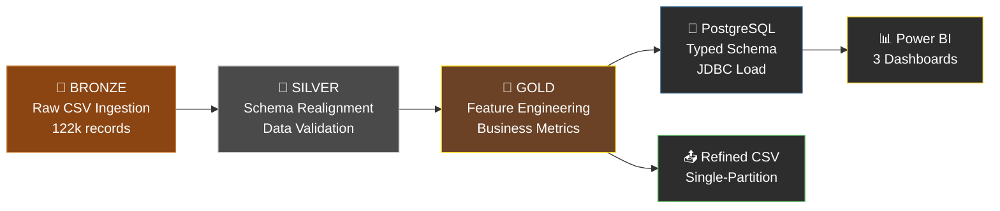
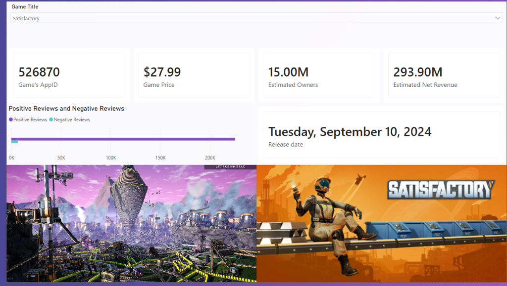
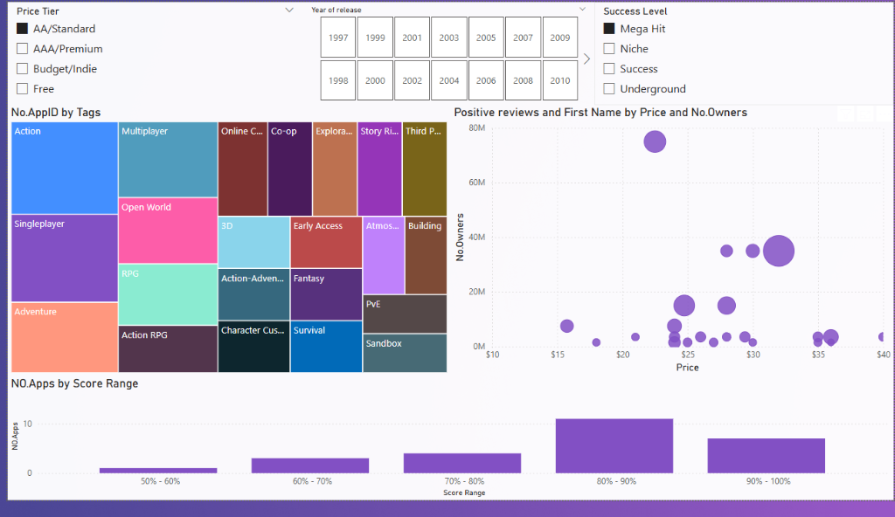
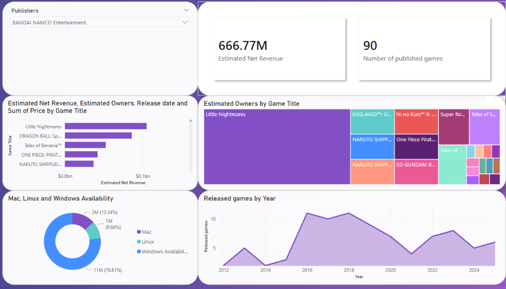

# 🎮 Steam Games Market Analysis — Big Data Pipeline

> An end-to-end Big Data pipeline and Business Intelligence suite that ingests, refines, and visualizes **122,000+** records of Steam marketplace data using a containerized ELT architecture.

[](https://spark.apache.org/)
[](https://www.postgresql.org/)
[](https://www.docker.com/)
[](https://powerbi.microsoft.com/)
[](https://www.kaggle.com/datasets/fronkongames/steam-games-dataset)

---

## 📋 Table of Contents

- [Architecture](#-architecture)
- [Tech Stack](#-tech-stack)
- [Dashboard Preview](#-dashboard-preview)
- [Engineering Challenges](#-engineering-challenges--solutions)
- [Data Modeling](#-data-modeling--derived-metrics)
- [Getting Started](#-getting-started)
- [Project Structure](#-project-structure)

---

## 🏗 Architecture — Medallion Pattern

The pipeline follows the **Medallion Architecture** (Bronze → Silver → Gold), a layered data quality pattern:



| Layer | Stage | What Happens |
|-------|-------|-------------|
| 🥉 **Bronze** | Raw Ingestion | `games.csv` loaded with `inferSchema=False` to prevent type corruption on shifted columns |
| 🥈 **Silver** | Cleaned & Validated | 13-column index shift corrected, nulls coalesced, non-ASCII names filtered, types enforced |
| 🥇 **Gold** | Business-Ready | Net revenue calculated, owner midpoints derived, age ratings inferred, OS flags optimized |

---

## 🔧 Tech Stack

| Layer | Technology | Purpose |
|-------|-----------|---------|
| **Engine** | PySpark 3.5 | High-performance data transformation and schema realignment |
| **Orchestration** | Docker Compose | System isolation — 7 containers (Spark master/worker, Jupyter, HDFS, Postgres, pgAdmin) |
| **Warehouse** | PostgreSQL 15 | Persistent storage with strict type enforcement |
| **Transport** | JDBC | Cross-container communication with PostgreSQL driver |
| **BI Layer** | Power BI Desktop | Interactive dashboards with DAX-driven calculations |

---

## 📊 Dashboard Preview

The Power BI suite contains **3 interactive pages**:

### Page 1 — Game Detail Explorer
Select any game to view its KPIs (price, estimated owners, net revenue), review sentiment, release date, and header image.



### Page 2 — Market Analysis
Filter by price tier, year of release, and success level. Explore tag distribution (treemap), price vs. owners (bubble chart), and score range distribution.



### Page 3 — Publisher Analytics
Drill into any publisher's portfolio — total revenue, game count, revenue breakdown by title, owner distribution, OS availability, and release trend over time.



---

## 🔬 Engineering Challenges & Solutions

### 1. Structural Dislocation
**Problem:** A merged `DiscountDLC count` header caused a **13-column index shift** — every column from index 7 onward was misaligned with its data.

**Solution:** Manual schema realignment in PySpark using indexed column selection with explicit aliasing:
```python
# Re-aligning shifted columns (Index 9 to 20)
*[f.col(headers[i+1]).alias(headers[i]) for i in range(9, 21)],
# Skipping dislocated User_Score (Index 22) to fix review metrics
*[f.col(headers[i+1]).alias(headers[i]) for i in range(22, 38)]
```

### 2. Type Impedance Mismatch
**Problem:** Spark string types failed to map to PostgreSQL numeric types, causing JDBC write failures.

**Solution:** Explicit type casting layer — all numeric columns force-cast to `int`/`float`, booleans handled via regex matching (`true|1|yes`), dates parsed from `MMM d, yyyy` to SQL-compatible `date` type.

### 3. Metadata Caching Conflict
**Problem:** Power BI cached stale column metadata after schema changes, causing persistent visualization errors.

**Solution:** Full cache flush and schema re-sync in Power BI — refreshed the data source connection and rebuilt all relationships.

---

## 📐 Data Modeling & Derived Metrics

The **Gold layer** produces these derived fields, none of which exist in the raw data:

| Metric | Formula | Purpose |
|--------|---------|---------|
| **Estimated Net Revenue** | `Price × (1 - Discount%) × MeanOwners × 0.7` | Revenue after Steam's 30% platform fee |
| **Mean Owners** | `(OwnerRangeLow + OwnerRangeHigh) / 2` | Numeric midpoint from categorical ranges |
| **Inferred Age Rating** | Tag-based regex (`Mature\|Gore` → 18, `Teen\|Blood` → 13) | Content classification from community tags |
| **Review Sentiment** | DAX: `Positive / (Positive + Negative) × 100` | 0–100% quality score with Success Level bucketing |
| **Price Tier** | DAX bucketing: Free / Indie / AA / AAA | Market segmentation for competitive analysis |

---

## 🚀 Getting Started

### Prerequisites
- [Docker Desktop](https://www.docker.com/products/docker-desktop/) installed and running
- [Power BI Desktop](https://powerbi.microsoft.com/desktop/) (for dashboard viewing)
- The `games.csv` dataset from [Kaggle](https://www.kaggle.com/datasets/fronkongames/steam-games-dataset)

### Setup

1. **Clone the repo** and place `games.csv` in the `shared/` directory:
   ```bash
   git clone <repo-url>
   cd steam-big-data-pipeline
   ```

2. **Download the dataset** from [Kaggle](https://www.kaggle.com/datasets/fronkongames/steam-games-dataset) and place `games.csv` in `shared/`.

3. **Start the containers:**
   ```bash
   docker compose up -d
   ```

4. **Open Jupyter** at `http://localhost:8888` and run the notebook `shared/ETL Pipeline for Steam game data.ipynb`.

5. **Open the dashboard** — launch `shared/Dashboard.pbix` in Power BI Desktop and connect to the PostgreSQL instance at `localhost:5432`.

### Container Ports

| Service | Port | URL |
|---------|------|-----|
| Jupyter Notebook | 8888 | http://localhost:8888 |
| Spark Master UI | 8080 | http://localhost:8080 |
| Spark Worker UI | 8081 | http://localhost:8081 |
| Spark Application | 4040 | http://localhost:4040 |
| HDFS NameNode | 9870 | http://localhost:9870 |
| PostgreSQL | 5432 | `localhost:5432` |
| pgAdmin | 8085 | http://localhost:8085 |

---

## 📁 Project Structure

```
steam-big-data-pipeline/
├── docker-compose.yml                          # 7-container orchestration
├── shared/
│   ├── ETL Pipeline for Steam game data.ipynb  # PySpark ETL notebook (Bronze → Silver → Gold)
│   ├── Dashboard.pbix                          # Power BI dashboard (3 pages)
│   └── games.csv                               # Raw dataset (not in repo — download from Kaggle)
├── screenshots/
│   ├── game_detail_dashboard.png
│   ├── market_analysis_dashboard.png
│   └── publisher_analysis_dashboard.png
├── .gitignore
└── README.md
```

---

## 👤 Author

**Mohammed** — E-JUST / DEPI Microsoft Data Engineer Track

---

## 📄 Data Source

[Steam Games Dataset](https://www.kaggle.com/datasets/fronkongames/steam-games-dataset) by Martin Bustos (FronkonGames) on Kaggle — information on 122,000+ games published on Steam.
